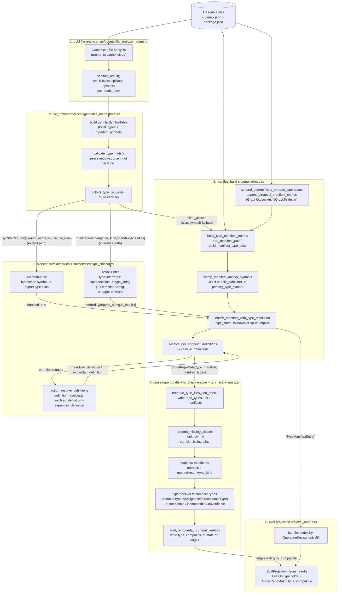

# Carrick Type Inference / Type Extraction Pipeline — Architecture Map

**Repo:** `carrick` (branch `main`)
**Scope:** READ-ONLY trace, current code as of 2026-06-26. Citations are `file:line` against the working tree.

> **Doc-vs-code provenance note.** Of the prior notes, only one is current. `docs/research/type-checking-flow.md` (Mar 2026) predates the sidecar entirely — it still describes `infer_types` aliases stored as `Response<{...}>` and ts_check `manifest-matcher` as the whole world; treat it as historical. `docs/research/compiler-sidecar-architecture/ARCHITECTURE.md` correctly carries a 2026-06 "this shipped" banner but its code listings are the *original proposal* (a `services/type_sidecar.rs` with only `bundle`/`infer`, a `generateDtsBundle` bundler, and `collect_type_requests` returning a 2-tuple) — the real code has diverged (4 actions, a 3-tuple, no `dts-bundle-generator` in the live bundler). `protocol-expansion-deep-dive.md` (Jun 2026) is accurate and load-bearing for the GraphQL/socket determinism story. `type-checking-improvements-plan.md` is the span/evidence plan; Stages 0–7 are largely realised in the code traced here.

---

## A. Pipeline diagram

### Mermaid flowchart



### Compact ASCII overview

```
 source files
     |
[1] file_analyzer (LLM)  -> EndpointResult / DataCallResult
     |  primary_type_symbol, type_import_source, emission_style,
     |  call_expression_span_*, response_expression_text/line, line_number
     v
[1a] sanitize_result()   -> scrub null/"node:"/suspicious; set needs_retry
     v
[2] file_orchestrator
     build SymbolTable -> validate_type_hints() (zero invalid symbol+source)
     collect_type_requests() routes EACH op:
        symbol+source present & valid ........ EXPLICIT  -> SymbolRequest  -> sidecar bundle
        symbol present, source None .......... EXPLICIT (same-file) -> SymbolRequest
        source present, symbol None .......... WARN, fall to inference
        neither / inference wins ............. InferRequestItem -> sidecar infer
        infer failed but symbol exists ....... inline_aliases (alias,symbol)
     alias = Endpoint_<fnv1a>_Response  (consumer: ..._Call<callhash>)
     v
[3] sidecar (stdio JSON; actions: init, bundle, infer, resolve_definitions)
     bundle: symbol -> `export type <alias> = ...`  (flattened .d.ts)
     infer:  span/text/line -> type_string (+wrapper unwrap via ExtractionConfig)
     resolve_definitions: alias -> resolved_definition (as-written) + expanded
     v
[4] engine manifest build (per repo -> CloudRepoData)
     build_type_manifest_entries / add_manifest_pair -> entries (type_state=Unknown)
     stamp_manifest_anchor_symbols: JOIN (file_path,line) -> primary_type_symbol
     enrich_manifest_with_type_resolution: Unknown -> Explicit/Implicit
     resolve_per_endpoint_definitions -> resolved/expanded_definition
     append_protocol_manifest_entries: GraphQL/socket ops (deterministic, no LLM)
     v
[5] cross-repo merge + ts_check
     recreate_type_files_and_check -> ts_check/output/<repo>_types.d.ts
       + producer-manifest.json + consumer-manifest.json
     append_missing_aliases: `= unknown // carrick:missing-alias`
     manifest-matcher: normalized (method,path,type_kind) pairs
     type-checker compareTypes: producerType.isAssignableTo(consumerType)
        -> compatible | incompatible | unverifiable(any/unknown)
     analyzer::overlay_compat_verdicts: write type_compatible on CrossRepoMatch
        Some(false)+reason | None(unverifiable) | Some(true) | Some(true)(key-parse-fail)
     v
[6] eval projection (src/eval_output.rs)
     ManifestIndex keyed by OperationKey.canonical()
     EvalProjection::from_results -> EvalOp{type_alias,type_state,resolved_definition,
        expanded_definition,is_explicit,primary_type_symbol(or type_alias fallback)}
     CrossRepoMatch{type_compatible, mismatch_reason}  (verbatim from analyzer)
```

---

## B. Stage-by-stage map

### Stage 1 — LLM file-analyzer (`src/agents/file_analyzer_agent.rs`, schema `src/agents/schemas.rs`)

- **Input:** one source file's text + SWC candidate hints (candidate IDs, spans, callee/method/path literals) + framework guidance. The prompt is in carrick-cloud (out of scope).
- **Output:** a `FileAnalysisResult` with `Vec<EndpointResult>` and `Vec<DataCallResult>`.
- **Key fields (EndpointResult, `file_analyzer_agent.rs:102-140`):** `candidate_id`, `line_number`, `method`, `path`, `handler_name`, `call_expression_span_start/end`, `response_expression_text`, `response_expression_line`, `emission_style` (`ReturnValue` | `ImperativeSend` | `NoPayload`), and the two type-anchor fields: `primary_type_symbol: Option<String>` and `type_import_source: Option<String>`.
- **Key fields (DataCallResult, `:142-176`):** `candidate_id`, `line_number`, `target`, `method`, `call_kind`, `call_expression_span_start/end`, `call_expression_text/line`, `payload_expression_text/line`, plus `primary_type_symbol` / `type_import_source`.
- **Contract told to the LLM** (`schemas.rs` `file_analysis_schema()`): `primary_type_symbol` = *"The primary type symbol name without wrappers (e.g. 'User' from 'Response<User[]>'). Extract just the identifier, not the full type."* `type_import_source` = *"Import path where the type is defined (e.g. './types/user'), null if inline or defined in the same file."*
- **In-file scrubbing:** `sanitize_result()` (`:398-527`) maps `"null"/"NULL"/"-"/""` -> `None`, strips `node:` prefixes, rejects import sources containing quotes/braces/colons or invalid relative paths, validates `primary_type_symbol` is an identifier, and sets `needs_retry` when a field looked corrupt. The older `response_type_string` is gone — the contract is now symbol + import-source + emission spans ("LLM emits where the type is, not what it is").

### Stage 2 — file_orchestrator routing (`src/agents/file_orchestrator.rs`)

- **Input:** `HashMap<file, FileAnalysisResult>`, repo path, `MountGraph`, `Config`.
- **Output (`collect_type_requests`, `:521-1025`):** `(Vec<SymbolRequest>, Vec<InferRequestItem>, Vec<(String,String)> /*inline_aliases*/)`.
- **Symbol-table gate (`validate_type_hints`, `:1123-1171`):** builds a per-file `SymbolTable` (`local_types`, `imported_symbols` with `kind`/`source`), then for each op: a local type is accepted only if there's no import source and no member access; an imported symbol only if `source` matches the real import and namespace-kind agrees; otherwise **both `primary_type_symbol` and `type_import_source` are zeroed** (`:1154-1155`), forcing the inference path.
- **Routing branch (endpoints `:742-770`, data_calls `:949-977`):**
  - `symbol.is_some() && source.is_some()` -> **explicit**: `push_explicit(symbol, resolve_import_path(file, source), alias)`.
  - `symbol.is_some() && source.is_none()` -> **explicit, same-file**: source = the file itself.
  - `source.is_some() && symbol.is_none()` -> `warn!(...)`, fall through to inference.
  - else / on explicit absence -> **inference**: `push_infer(...)` with `InferKind::FunctionReturn` (emission `ReturnValue`), `ResponseBody` (`ImperativeSend`/`None`), or `CallResult` (data calls). `NoPayload` emits nothing.
  - If inference can't be built but a `primary_type_symbol` survives -> `inline_aliases.push((alias, symbol))` (`:858-862`, `:998-1000`).
- **Locators (`push_infer`, `:590-655`):** prefers `Span{start,end}` (SWC byte offsets), then `Text{expression_text,line}` (LLM verbatim expression), then bare `Line`. The first that can be built wins.
- **Alias = the manifest join key** (`src/type_manifest.rs:33-69`): `build_manifest_type_alias(key, role, kind)` = `Endpoint_<fnv1a_16hex>_{Request|Response}`; consumers append `_Call<callhash>` via `build_manifest_type_alias_with_call_id`. The hash is over `OperationKey.canonical()|role|kind`. The same alias string must reappear in the bundled `.d.ts` or the entry resolves to `unknown`.
- **Driver:** `resolve_types_with_sidecar` (`:1486`) -> `sidecar.resolve_all_types(&explicit, &infer, extraction_config)`; wrapper rules (`wrapper_rules_for_packages`) feed `ExtractionConfig` for the infer pass.

### Stage 3 — sidecar (`src/sidecar/src/*`, Rust client `src/services/type_sidecar.rs`)

Live stdio JSON protocol, tagged `action`. **Only four actions are actually driven by the scanner's Rust engine:** `init`, `bundle`, `infer`, `resolve_definitions` (`type_sidecar.rs:160-189`), plus `health`/`shutdown`.

- **`bundle`** (`bundler.ts` `TypeBundler.bundle`): input `SymbolRequest[]`; validates each symbol exists in its `source_file` (rejecting `%none%`/`%inline%`/missing files), extracts via ts-morph `getText()`, and emits `export type <alias> = ...;` lines into one flattened `.d.ts`. Output: `dts_content` + a per-symbol manifest (`is_explicit: true`).
- **`infer`** (`type-inferrer.ts`): input `InferRequestItem[]` (`infer_kind` + span/text/line) and optional `ExtractionConfig`. Resolves the node by span/text/line, gets `Type`, unwraps `Promise<T>`, and applies AST-verified wrapper unwrap rules (e.g. `axios` `AxiosResponse.data`, gated on `originModuleGlobs` so a local `AxiosResponse` won't be unwrapped). Output: `InferredType{alias, type_string, is_explicit, source_location, infer_kind, payload_type_string?}`.
- **`resolve_definitions`** (`definition-resolver.ts:66-96`): input bundled `.d.ts` + alias names; for each alias finds the decl and returns two strings:
  - `resolved_definition` = `decl.getText()` — the declaration **as written** (named refs preserved).
  - `expanded_definition` = `decl.getType().getText(decl, NoTruncation | InTypeAlias)` — compiler-printed type with truncation disabled.
- **monorepo-builder.ts / emit_surface / check_compatibility:** present in the sidecar TS but **NOT invoked by the scanner's Rust engine** in the live REST type-check path (no `EmitSurface`/`MonorepoBuild`/`CheckCompat` variant in `SidecarRequest`). The cross-repo check runs through ts_check, not the monorepo builder. Treat the monorepo builder as a separate/parallel facility, not part of this pipeline.

### Stage 4 — manifest build (`src/engine/mod.rs`; struct in `src/cloud_storage/mod.rs:71-107`)

`TypeManifestEntry` fields: `key` (flattened `OperationKey`), `role` (Producer|Consumer), `type_kind` (Request|Response), `type_alias`, `file_path`, `line_number`, `is_explicit`, `type_state` (Explicit|Implicit|Unknown), `evidence` (`TypeEvidence`), `resolved_definition: Option<String>`, `expanded_definition: Option<String>`, `primary_type_symbol: Option<String>`. (`type_compatible` is **not** on the entry — it lives on the cross-repo edge.)

- **`build_type_manifest_entries` (`:1743`)** — input mount graph; output `Vec<TypeManifestEntry>` (Request+Response per op; producers skip Request for GET/HEAD/OPTIONS). All entries start `type_state=Unknown`, definitions `None`.
- **`add_manifest_pair` (`:1847`)** — appends a pair, computing `type_alias` via `build_manifest_type_alias_with_call_id`.
- **`stamp_manifest_anchor_symbols` (`:1812`)** — builds a `HashMap<(file_path, normalized_line), symbol>` from `file_results` and joins it onto entries on **`(file_path, line_number)`**, normalizing `line<=0 -> 1`. First non-None symbol per key wins. This is the fragile anchor join (#243).
- **`enrich_manifest_with_type_resolution` (`:1910`)** — merges bundle + infer results, scans the bundled `.d.ts`, and promotes `type_state` Unknown->Explicit/Implicit when an alias resolved to a non-trivial type; downgrades to Unknown if it resolves to `unknown`/`any`/empty or only a `// carrick:missing-alias` placeholder exists.
- **`resolve_per_endpoint_definitions` (`:1696`)** — for each non-Unknown alias, calls `sidecar.resolve_definitions` and writes `resolved_definition` / `expanded_definition`.
- **`append_deterministic_protocol_operations` (`:1123`) / `append_protocol_manifest_entries` (`:1207`)** — GraphQL (`graphql.rs`) and Socket.IO (`socket_io.rs`) ops are extracted deterministically (regex/parse, **no LLM, no sidecar inference**) and get Response-only entries with `type_alias` via the same `build_manifest_type_alias`. Socket entries carry a deterministic `primary_type_symbol`; GraphQL leaves it `None` (anchor deferred, #248).

### Stage 5 — cross-repo bundle + ts_check (`engine/mod.rs`, `ts_check/lib/*`, `analyzer/mod.rs`)

- **`build_cross_repo_analyzer` (`:2159`)** merges all `CloudRepoData`, then **`recreate_type_files_and_check` (`:2213`)** writes `ts_check/output/<repo>_types.d.ts`, `producer-manifest.json`, `consumer-manifest.json` (via `write_manifest_files` `:2262`), and runs ts-node.
- **`append_missing_aliases` (`:2319`)** pads the `.d.ts`: any manifest `type_alias` not already declared gets `export type <alias> = unknown; // carrick:missing-alias`. The marker lets ts_check distinguish a Carrick placeholder from a dev-authored `unknown`.
- **`manifest-matcher.ts`** pairs producer<->consumer entries on normalized `(method, path, type_kind, protocol)` (params `{id}`/`[id]`/`:id` -> `:param`, numeric segments -> `:param`).
- **`type-checker.ts` `compareTypes` (`:276-369`)** — pulls each side's `Type` from the bundled project via `resolveTypeInfo`/`findTypeInProject`, then:
  - missing type -> `incompatible` ("not found in project").
  - either side `isAny()`/`isUnknown()` -> **`unverifiable`** (`:315-345`) — explicitly refusing to read `unknown`-vs-X as compatible.
  - else `producerType.isAssignableTo(consumerType)` -> `compatible`/`incompatible`. **This is a live compiler assignability check on `Type` objects, not a text comparison and not a synthetic probe expression.**
- **`analyzer::overlay_compat_verdicts` (`:1765`)** reads `type-check-results.json`, builds `incompatible` (method,path->reason) and `unverifiable` sets, then per `CrossRepoMatch` edge (`analyzer/mod.rs:97-113`): producer_key parse-fail -> `Some(true)`; in `incompatible` -> `Some(false)`+`mismatch_reason`; in `unverifiable` -> `None`; else `Some(true)`. Edges start life `type_compatible: None` at creation (`:1326`/`:1415`).

### Stage 6 — eval projection (`src/eval_output.rs`)

- **`ManifestIndex` (`:176-208`)** = `HashMap<String, ManifestFields>` keyed by `OperationKey::canonical()`. Collapses the Request+Response entries per op, preferring the one with a concrete definition; merges `primary_type_symbol` independently (first non-None wins).
- **`EvalProjection::from_results(result, type_manifest)` (`:110`)** — for each `EvalOp` (`EvalOp::from_details`, `:228-263`) it emits, from the ManifestIndex lookup: `type_alias`, `type_state`, `resolved_definition`, `expanded_definition`, `is_explicit`, and `primary_type_symbol` **falling back to `type_alias` when the symbol is absent** (`:257-261`). Each `CrossRepoMatch` (`:267-277`) carries `type_compatible` and `mismatch_reason` **copied verbatim** from the analyzer edge (no remap).
- **Silent-failure surface:** every type field is `#[serde(default, skip_serializing_if="Option::is_none")]`, so an op with no manifest match silently omits the field — the scorer can't tell "evaluated, None" from "never present."

---

## C. End-to-end trace: `GET /orders/:id` (`Order` producer vs `OrderView` consumer)

> **Fixture-vs-prompt discrepancy (important).** The HTTP `Order` is flatter than commonly described. The **actual** corpus producer (`orders-monorepo/packages/orders-pkg/src/types.ts:4-8`) is:
> ```ts
> export interface Order { id: number; amountCents: number; currency: string }
> ```
> The `Money` / discriminated-union / optional-`note` shape does **not** exist on the HTTP `Order`. The `note`/optionality mismatch is a **separate GraphQL subscription edge** in `expected-output.json` (`gateway graphql|subscription|orderUpdated` -> `web-frontend`, reason *"consumer OrderUpdate.note is required but producer Order.note is optional"*). The HTTP edge's expected verdict is the `id` mismatch.

**Producer side — `orders-pkg`, `GET /orders/:id`:**

1. **[1]** `orders.routes.ts:18`: `ordersRouter.get<Order>('/:id', async (req, reply): Promise<Order> => {...})`. With `import type { Order } from './types'`, the analyzer should emit `primary_type_symbol="Order"`, `type_import_source="./types"`, `emission_style=ReturnValue`, `line_number~=18`. (An "inconsistent emission" risk point — a fastify `.get<Order>` generic, not a plain `res.json`.)
2. **[2]** `validate_type_hints` checks `Order` in `imported_symbols` with source `./types` — passes; explicit path. `collect_type_requests` emits `SymbolRequest{symbol_name:"Order", source_file: <abs>/types.ts, alias: Endpoint_<h>_Response}`. Producer alias has **no** `_Call` suffix.
3. **[3]** sidecar `bundle` resolves `Order` from `types.ts` -> `export type Endpoint_<h>_Response = { id: number; amountCents: number; currency: string };` in `orders-pkg_types.d.ts`.
4. **[4]** manifest entry: `key=http|GET|/orders/:param`, role=Producer, type_kind=Response, `type_alias=Endpoint_<h>_Response`. `stamp_manifest_anchor_symbols` joins on `(orders.routes.ts, 18)` -> `primary_type_symbol="Order"`. `enrich` promotes `type_state=Explicit`. `resolve_per_endpoint_definitions` sets `resolved_definition`, `expanded_definition="{ id: number; amountCents: number; currency: string }"`.

**Consumer side — `web-frontend`, `fetchOrder`:**

5. **[1]** `api.ts:35-41`: `fetchOrder(id: string): Promise<OrderView>` whose body does `return res.json() as Promise<OrderView>`. The brittle part: the return annotation and the `as Promise<OrderView>` cast both name `OrderView`, but `OrderView` is **declared in the same file** (`api.ts:15-18`), not imported. Best case: `primary_type_symbol="OrderView"`, `type_import_source=None` -> explicit same-file path; the `call_result` inference on `fetch(...).json()` (no static return type from `fetch`) is the fallback.
6. **[2]** `OrderView` in `local_types`, no source, no member -> `validate_type_hints` accepts. If explicit survives: `SymbolRequest{symbol_name:"OrderView", source_file: api.ts, alias: Endpoint_<h>_Response_Call<callhash>}`. If the LLM instead routes to inference (type only appears as a cast), it emits `InferRequestItem{infer_kind:CallResult, ...}` and inference on `fetch().json()` returns `Promise<any>`/`any` -> `OrderView` never enters the bundle.
7. **[3]** *If explicit:* sidecar bundles `export type Endpoint_<h>_Response_Call<id> = { id: string; currency: string };` into `web-frontend_types.d.ts`. *If inference:* nothing concrete is bundled for the consumer.
8. **[4]** consumer manifest entry `key=http|GET|/orders/:param`, role=Consumer, type_kind=Response, anchor `OrderView`, `type_state=Explicit` (explicit) or `Unknown` (inference fallback -> `append_missing_aliases` injects `= unknown`).
9. **[5]** matcher pairs producer `Endpoint_<h>_Response` <-> consumer `Endpoint_<h>_Response_Call<id>` on normalized `(GET, /orders/:param, response)`. `compareTypes`:
   - **Correct outcome (both shapes bundled):** producer `{id:number; amountCents:number; currency:string}`. `isAssignableTo({id:string; currency:string})` -> **false** (`number` not assignable to `string`). -> `incompatible`. `overlay_compat_verdicts` writes `type_compatible=Some(false)` + reason. **Matches `expected-output.json`: `type_compatible: false`.**
   - **Where it currently breaks (the "compat=None"):** if the consumer `OrderView` shape never reaches `web-frontend_types.d.ts` (inference returns `any`/`unknown`, or the explicit symbol was dropped), `compareTypes` hits the `isAny()/isUnknown()` guard -> `unverifiable` -> `type_compatible=None`. The edge reads `None` instead of the correct `false`. Equally, if ts_check produced no results file at all, `overlay_compat_verdicts` early-returns (`analyzer/mod.rs:1769`) and **every** edge stays at its `None` birth value (the all-`None` failure mode, #253).
10. **[6]** `EvalProjection` emits the producer `EvalOp` and the `CrossRepoMatch{producer_repo:"orders-pkg", consumer_repo:"web-frontend", producer_key:"http|GET|/orders/:param", type_compatible: <false | None>, mismatch_reason}`. The scorer compares this to the expected `false`.

**Verdict the corpus expects:** `INCOMPATIBLE` (`id: number` vs `id: string`). The pipeline produces it **only if both shapes reach their bundles**; the live break is the consumer `OrderView` not reaching `web-frontend_types.d.ts`, which downgrades the edge to `unverifiable`/`None`.

---

## D. Per-stage critique (fragilities & silent-failure modes)

**Stage 1 — LLM analyzer.**
- *Inconsistent `primary_type_symbol` emission across HTTP ops.* The contract asks for a bare identifier "without wrappers," but the producer expresses the type as a fastify generic `.get<Order>` and a `Promise<Order>` return annotation, while the consumer expresses it as `return res.json() as Promise<OrderView>`. These are different syntactic homes; the LLM emits the symbol reliably for clean annotations and unreliably for casts/generics. When omitted, the op silently drops to inference, which on a raw `fetch().json()` yields `any`. This is the upstream cause of the consumer-not-in-bundle break.
- `sanitize_result` (`:398-527`) is defensive but only *removes* bad hints; it cannot *recover* a symbol the LLM never emitted. A dropped symbol is silent (no error, just inference).

**Stage 2 — orchestrator routing.**
- `validate_type_hints` zeroing **both** fields on any mismatch (`:1154-1155`) is strict-but-blunt: a correct symbol with a slightly-off `type_import_source` (`./types` vs `./types.ts`) loses the *whole* explicit path, not just the bad source. The fix-up for same-file vs imported is the most failure-prone branch.
- The `source.is_some() && symbol.is_none()` branch only `warn!`s and proceeds to inference (`:763-770`) — an import source with no symbol is wasted.
- The `inline_aliases` fallback (`:858-862`) preserves a *name* but no resolvable definition; downstream this becomes an unverifiable `unknown` unless something else bundles the symbol.

**Stage 3 — sidecar.**
- **#246: `expanded_definition` does not inline *named member* types.** `definition-resolver.ts:84-87` uses `type.getText(decl, NoTruncation | InTypeAlias)`. `NoTruncation` only defeats the `...` width cutoff; it does **not** force structural expansion of *named* members. A field `money: Money` is printed as `money: Money`, not `money: { amount: number; currency: string }`, because TS prints a referenced type by its symbol name when that symbol is in scope. (This is cosmetic-for-the-verdict, since `compareTypes` uses live `Type.isAssignableTo`, not the expanded text — but it matters for any consumer of `expanded_definition`, e.g. eval scoring and reports.)
- Inference returning `Promise<any>` for `fetch().json()` (no typed client) silently produces `any`, which the downstream guard maps to `unverifiable`. The wrapper registry only helps when an AST-verified wrapper symbol from a known package is present.
- The `monorepo-builder`/`emit_surface` code is live in the TS tree but **not wired into the scanner's type-check path** — a trap for anyone reading the sidecar in isolation. The Rust engine only drives `bundle`/`infer`/`resolve_definitions`.

**Stage 4 — manifest build.**
- **#243: the `(file_path, line)` anchor join is fragile.** `stamp_manifest_anchor_symbols` (`:1812`) joins LLM anchors onto entries on `(file_path, line)` with `line<=0 -> 1` normalization on both sides. The manifest line comes from `MountGraph` `file_location` parsing; the anchor line comes from the LLM `line_number`. Any drift (handler line vs `res.json` line vs mount line; 0/None normalised to 1 colliding with a real line-1 entry) silently fails the join -> `primary_type_symbol` stays `None`.
- **#240: `type_alias` hash fallback masks missing anchors.** In eval projection, `primary_type_symbol` falls back to `type_alias` (`eval_output.rs:257-261`). So an op whose anchor join failed still surfaces a non-empty value (the `Endpoint_<hash>_Response` string), which can read as "we have a symbol" when we don't. The hashed alias is *always* present, so a missing real anchor is masked rather than surfaced.
- Protocol entries (`append_protocol_manifest_entries`) deliberately bypass the sidecar; GraphQL leaves `primary_type_symbol=None` by design (#248), so GraphQL ops never get an anchor at all.

**Stage 5 — cross-repo / ts_check.**
- **#253: compat regressed to all-`None`.** Two concrete code paths produce it: (a) `overlay_compat_verdicts` early-returns if `check_type_compatibility` errors — missing/empty `type-check-results.json`, or a results file carrying an `error` key (`analyzer/mod.rs:1769`, `:1607-1608`) — leaving every edge at its `None` birth value (`:1326`/`:1415`); (b) every consumer shape resolving to `unknown` (the Stage-3 break above) routes every edge through the `unverifiable` branch -> `None`. Distinguishing "ts_check didn't run" from "every type was unverifiable" requires checking whether the results file existed at all — both surface identically as all-`None` to the scorer.
- The `isAny()/isUnknown() -> unverifiable` guard (`:315-345`) is correct and intentional (it stops `unknown`-vs-X reading as compatible), but it means *any* extraction miss on either side downgrades a real mismatch to `None` rather than `false` — a false-negative for drift, the worse direction for a drift detector.
- The non-HTTP `producer_key` parse-fail branch sets `Some(true)` (`analyzer/mod.rs:1815`) — GraphQL/socket edges that can't be parsed as `http|METHOD|path` default to *compatible*, not `None`. For the corpus, the GraphQL `orderUpdated` edge is expected `false`; this fallback is a path to a false "compatible."

**Stage 6 — eval projection.**
- `skip_serializing_if = Option::is_none` on every type field (`eval_output.rs:54-95`) means a missing field is *absent*, not `null`. The scorer cannot distinguish "computed and empty" from "never produced," so silent extraction misses look the same as legitimate no-type ops.
- `CrossRepoMatch.type_compatible` is copied verbatim, so all the Stage-5 `None`/`Some(true)`-fallback fragilities pass straight through to scoring unmodified.

**Monorepo GraphQL producer mis-attribution (#242).** Per `protocol-expansion-deep-dive.md` §3, all GraphQL ops live at one `/graphql` URL; in `orders-monorepo` the `gateway` package is the GraphQL producer (`gateway/src/orders.resolver.ts`) while `orders-pkg` is the REST producer. The expected output attributes `graphql|query|order` to `gateway` — but with multiple packages in one monorepo, a GraphQL producer can be mis-attributed to a sibling package. (Fix in flight: #242 scopes SDL discovery to the service's own roots.)

**Where the docs disagree with the code (call-outs for the reader):**
- `type-checking-flow.md` describes `response_type_string` and `infer_types` aliases as the mechanism — both gone; the live contract is `primary_type_symbol`+`type_import_source`+spans and the four-action sidecar.
- `compiler-sidecar-architecture/ARCHITECTURE.md` code listings show `collect_type_requests` returning `(explicit, infer)` and a `generateDtsBundle` bundler — the live code returns a 3-tuple (adds `inline_aliases`) and the live bundler emits `export type` lines directly without `dts-bundle-generator`.
- Neither doc mentions that `compareTypes` is a *live `Type.isAssignableTo`* check (not text), nor the `unknown -> unverifiable` guard, nor the `// carrick:missing-alias` placeholder convention — all central to how a verdict (or a `None`) is produced today.
